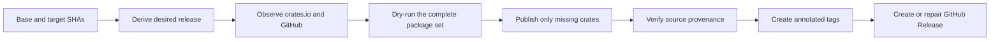

# Cargo Release

[](https://github.com/ZcashFoundation/cargo-release/actions/workflows/ci.yml)
[](LICENSE)

Cargo Release makes multi-package Cargo workspace releases recoverable across
GitHub Actions workflow reruns. It derives the intended release from 2 immutable
commits, observes crates.io and GitHub, delegates package ordering to Cargo, and
creates only the missing release state.

> [!TIP]
> **Decision shortcut:** Use Cargo Release when several workspace crates must
> publish as one logical release and a failed run must safely continue instead
> of restarting from the beginning.

The goal is a complete, verifiable release after any number of reruns. An
already-complete release is a no-op, partial progress is preserved, and any
published crate or tag that points at another source commit stops for human
review.

## Should you use it?

| Use Cargo Release when                                                                  | Prefer simpler tooling when                                                    |
| --------------------------------------------------------------------------------------- | ------------------------------------------------------------------------------ |
| Several publishable workspace crates can change together.                               | A release contains one independent crate.                                      |
| New versions of workspace crates depend on one another.                                 | `cargo publish` or `release-plz release` already completes the whole workflow. |
| Publication, product verification, tags, and a GitHub Release happen in separate steps. | Only crate publication is required.                                            |
| A rerun must resume after crates.io accepted only part of the release.                  | Operators can resolve partial publication manually.                            |
| Existing crate versions and tags must match an approved source commit.                  | Source provenance and GitHub finalization are handled elsewhere.               |

This action is not specific to Zebra. It supports a single Rust package or one
Cargo workspace in any GitHub repository that publishes to crates.io, although
multi-crate workspaces receive the most benefit.

> [!NOTE]
> Cargo Release supports GitHub, crates.io, Cargo 1.90 or newer, annotated Git
> tags, and an optional product-level GitHub Release. It does not support other
> Git forges, other Cargo registries, or multiple workspaces in one invocation.

## The failure model

Publishing a workspace changes several independent systems: crates.io stores
immutable crate versions, Git stores tags, and GitHub stores mutable release
metadata. No transaction covers all 3 systems, so a workflow can stop after any
successful write.

> [!IMPORTANT]
> Cargo can order and publish interdependent workspace crates, but publication
> remains non-atomic. If a later upload fails, earlier crate versions remain
> permanently published and the next run must continue from that external
> state.

Several workspace shapes can expose this problem:

- **Interdependent crates:** crate `app` depends on the new version of crate
  `core`. Validating `app` alone fails while `core` exists only in the same
  unpublished release.
- **Independent release groups:** several crates can publish successfully before
  an unrelated crate fails, which leaves only part of the approved package set
  on crates.io.
- **Split registry and Git state:** a crate can be published without its tag, or
  a tag can exist while its crate is still missing.
- **Product finalization:** every crate and tag can exist while a later
  verification step or GitHub Release creation fails.
- **Registry propagation:** crates.io can accept an upload before every
  observation endpoint reports it, so immediate replay can mistake progress for
  failure.

These failure modes were observed across several release attempts in a large
Rust workspace, with different immediate errors. They are not
repository-specific: workspaces with shared versions, internal dependency
edges, or separate library and application crates are especially exposed. The
common failure is treating irreversible external writes as the output of one
uninterrupted command.

## What Cargo solved, and what remained

The release workflow that motivated this action used
[release-plz 0.3.160](https://github.com/release-plz/release-plz/tree/7e38e7a93dff31bbf6312400f79b9de36e8d3834).
These claims are scoped to that exact version rather than current upstream
development. Its release command iterates over packages and runs one
`cargo publish` command for each crate. During a dry run, an `app` crate
therefore cannot verify against the new `core` version from the same release
unless `core` is already on the registry. The command output contains packages
published during that invocation, not a durable description of the whole
desired release. It also returns early when a tag exists and skips tag creation
when a crate is already published. Those behaviors work for a successful
uninterrupted run, but they do not cover reconciliation after partial progress.

This is a boundary mismatch, not a claim that release-plz cannot publish Cargo
workspaces. Projects that do not need cross-run recovery can continue using its
simpler release command.

[Cargo 1.90 stabilized multi-package publishing](https://doc.rust-lang.org/cargo/CHANGELOG.html#cargo-190-2025-09-18),
including `cargo publish -p core -p app`. Cargo now builds one
dependency-aware plan, packages selected crates in dependency order, and uses a
temporary local registry while verifying interdependent packages. Cargo solved
the package graph and dry-run problem, but its release notes explicitly retain
the non-atomic failure model.

Cargo Release fills the remaining controller gap. On every run, it reconstructs
the complete desired release and asks Cargo to dry-run the complete package set.
It then publishes only missing crates, verifies published source provenance,
creates tags after every crate matches, and creates or repairs the optional
GitHub Release last.

| Layer                                                     | Responsibility                                                                                                |
| --------------------------------------------------------- | ------------------------------------------------------------------------------------------------------------- |
| [release-plz](https://github.com/release-plz/release-plz) | Update versions and changelogs, then prepare the Release PR.                                                  |
| Cargo                                                     | Resolve the selected package graph, verify packages together, and order publication.                          |
| Cargo Release                                             | Observe desired state across runs, publish only missing crates, verify provenance, and finalize GitHub state. |

<details>
<summary>Exact source behavior behind the design</summary>

- release-plz 0.3.160
  [loops over publishable packages](https://github.com/release-plz/release-plz/blob/7e38e7a93dff31bbf6312400f79b9de36e8d3834/crates/release_plz_core/src/command/release.rs#L579-L617),
  [returns when a tag already exists](https://github.com/release-plz/release-plz/blob/7e38e7a93dff31bbf6312400f79b9de36e8d3834/crates/release_plz_core/src/command/release.rs#L627-L635),
  and [builds one `cargo publish --package` command per crate](https://github.com/release-plz/release-plz/blob/7e38e7a93dff31bbf6312400f79b9de36e8d3834/crates/release_plz_core/src/command/release.rs#L1154-L1200).
- Cargo 1.91
  [builds and executes one dependency-aware publish plan](https://github.com/rust-lang/cargo/blob/ea2d97820c16195b0ca3fadb4319fe512c199a43/src/cargo/ops/registry/publish.rs#L71-L360)
  and [packages interdependent crates against a temporary local registry](https://github.com/rust-lang/cargo/blob/ea2d97820c16195b0ca3fadb4319fe512c199a43/src/cargo/ops/cargo_package/mod.rs#L248-L359).
- crates.io trusted credentials come from the official
  [crates-io-auth-action](https://github.com/rust-lang/crates-io-auth-action).

</details>

## How a release converges



The target commit is the desired source of truth. The action selects
crates.io-publishable workspace packages whose versions differ between the base
and target commits, then observes every planned crate, tag, and optional GitHub
Release before writing anything.

Existing crate versions count as complete only when their packaged
`.cargo_vcs_info.json` records the target commit without a dirty source flag.
Tags must resolve to the same target commit. Mutable GitHub Release metadata can
be repaired, but contradictory immutable state stops the run.

## Adjacent tools

Cargo Release owns the post-merge publication and recovery boundary. These
tools cover neighboring or alternative responsibilities:

| Tool                                                                        | Use it for                                                                                                                  |
| --------------------------------------------------------------------------- | --------------------------------------------------------------------------------------------------------------------------- |
| [cargo-release CLI](https://github.com/crate-ci/cargo-release)              | Preparing and executing Cargo releases from a local or CI command. This action does not invoke or wrap the CLI.             |
| [crates-io-auth-action](https://github.com/rust-lang/crates-io-auth-action) | Supplying a short-lived crates.io token through trusted publishing.                                                         |
| [dist](https://github.com/axodotdev/cargo-dist)                             | Building and distributing binaries or installers after the source release is complete.                                      |
| [publish-crates](https://github.com/katyo/publish-crates)                   | Publishing workspaces through its own dependency checks and ordering instead of delegating multi-package ordering to Cargo. |

## Quick start

### 1. Add release policy

Create `.github/cargo-release.yml` in the consuming repository:

```yaml
tagTemplate: "{name}-v{version}"
```

That minimal policy publishes every changed crates.io package and creates one
annotated tag per package. Add a product-level GitHub Release when the workspace
contains a primary application or server:

```yaml
tagTemplate: "{name}-v{version}"

packageOverrides:
  example-server:
    tagTemplate: "v{version}"

githubRelease:
  package: example-server
  nameTemplate: "Example Server {version}"
  notesFile: CHANGELOG.md
  notesHeadingTemplate: "## [Example Server {version}]"
  makeLatest: auto
```

The optional GitHub Release is included only when its configured package
version changes. A library-only release therefore publishes crates and creates
crate tags without creating a product release.

### 2. Configure crates.io

Configure [trusted publishing](https://crates.io/docs/trusted-publishing) for
each existing crate, then allow the release job to request an OpenID Connect
token with `id-token: write`. The first version of a new crate may need to be
published with a conventional crates.io token before trusted publishing can be
configured for later versions.

### 3. Add a workflow

This complete workflow runs a release from start to finish. Replace
`<full-commit-sha>` with a released commit from this repository.

```yaml
name: Release Cargo workspace

on:
  workflow_dispatch:
    inputs:
      base_sha:
        description: Commit before the approved version changes
        required: true
        type: string
      target_sha:
        description: Approved release commit
        required: true
        type: string

permissions:
  contents: write
  id-token: write

jobs:
  release:
    runs-on: ubuntu-latest
    environment: release

    steps:
      - name: Checkout approved release commit
        uses: actions/checkout@3d3c42e5aac5ba805825da76410c181273ba90b1 # v7.0.1
        with:
          ref: ${{ inputs.target_sha }}
          fetch-depth: 0
          persist-credentials: false

      - name: Install Cargo 1.90
        uses: actions-rust-lang/setup-rust-toolchain@166cdcfd11aee3cb47222f9ddb555ce30ddb9659 # v1.17.0
        with:
          toolchain: "1.90.0"

      - name: Authenticate to crates.io
        id: crates_io
        uses: rust-lang/crates-io-auth-action@c6f97d42243bad5fab37ca0427f495c86d5b1a18 # v1.0.5

      - name: Publish and finalize release
        uses: ZcashFoundation/cargo-release@<full-commit-sha>
        with:
          phase: all
          base-sha: ${{ inputs.base_sha }}
          target-sha: ${{ inputs.target_sha }}
          github-token: ${{ github.token }}
        env:
          CARGO_REGISTRY_TOKEN: ${{ steps.crates_io.outputs.token }}
```

The base SHA must be an ancestor of the target SHA, and both values must be full
40-character commit IDs. The target checkout must be clean and contain full
history. In a release-plz workflow, these commits normally bracket the merged
Release PR, but each repository retains authority over that policy.

Pin every action to a full commit SHA. GitHub treats a full SHA as the only
immutable action reference, and Dependabot can keep pinned actions current.

### Triggering downstream workflows

Tags and releases created with the workflow's `GITHUB_TOKEN` do not normally
start new workflow runs. If finalization should trigger artifact or deployment
workflows, pass a GitHub App installation token or a suitably scoped personal
access token as `github-token`.

For a GitHub App, generate the token with
[actions/create-github-app-token](https://github.com/actions/create-github-app-token)
and grant only `contents: write`.

## Add a product verification gate

Server and application repositories often need to verify the published product
before exposing a public tag or GitHub Release. Split publication and
finalization around that repository-owned check:

```yaml
- name: Publish missing crates
  uses: ZcashFoundation/cargo-release@<full-commit-sha>
  with:
    phase: publish
    base-sha: ${{ inputs.base_sha }}
    target-sha: ${{ inputs.target_sha }}
    github-token: ${{ steps.release_app.outputs.token }}
  env:
    CARGO_REGISTRY_TOKEN: ${{ steps.crates_io.outputs.token }}

- name: Verify the published product
  run: cargo install --locked example-server --version "${{ inputs.version }}"

- name: Finalize tags and GitHub Release
  uses: ZcashFoundation/cargo-release@<full-commit-sha>
  with:
    phase: finalize
    base-sha: ${{ inputs.base_sha }}
    target-sha: ${{ inputs.target_sha }}
    github-token: ${{ steps.release_app.outputs.token }}
```

The `publish` phase completes only after every planned crate matches the target
commit. The `finalize` phase then creates missing tags and the optional GitHub
Release. A failed verification leaves a recoverable release with no public
finalization state.

## Recovery behavior

Each run submits a missing package set to Cargo at most once, then polls
crates.io without resubmitting that set. A later workflow rerun observes what
succeeded and derives the remaining package set from external state.

| State         | Meaning                                                                    | Result                                                             |
| ------------- | -------------------------------------------------------------------------- | ------------------------------------------------------------------ |
| `matching`    | The object matches the target commit and release plan.                     | Keep it unchanged.                                                 |
| `missing`     | The object does not exist.                                                 | Create it in `publish`, `finalize`, or `all`.                      |
| `repairable`  | A GitHub Release has the correct tag but mutable metadata differs.         | Update its name, notes, draft state, or explicit latest selection. |
| `conflicting` | Existing immutable state points at another commit or contradicts the plan. | Stop before further writes.                                        |
| `transient`   | crates.io or GitHub could not be observed reliably.                        | Stop with a retryable report.                                      |

Finalization starts only after every planned crate version exists with the
expected Cargo-recorded commit. The action creates tags next and the optional
GitHub Release last, re-observing state after each mutation attempt to handle
concurrent creation safely.

## Configuration reference

Templates support `{name}` and `{version}`:

| Field                                 | Required             | Default             | Purpose                                                     |
| ------------------------------------- | -------------------- | ------------------- | ----------------------------------------------------------- |
| `tagTemplate`                         | No                   | `{name}-v{version}` | Tag format for every selected package.                      |
| `packageOverrides.<name>.tagTemplate` | No                   | Global tag template | Per-package tag format.                                     |
| `githubRelease.package`               | For a GitHub Release |                     | Package whose version identifies the product release.       |
| `githubRelease.nameTemplate`          | No                   | `{name} {version}`  | GitHub Release name.                                        |
| `githubRelease.notesFile`             | For a GitHub Release |                     | Release notes file inside the target checkout.              |
| `githubRelease.notesHeadingTemplate`  | No                   | Entire notes file   | Markdown heading prefix used to select one release section. |
| `githubRelease.prerelease`            | No                   | Derived from semver | Override prerelease status.                                 |
| `githubRelease.makeLatest`            | No                   | `auto`              | `auto`, `true`, or `false`; YAML booleans are accepted.     |

`notesHeadingTemplate` must render a Markdown heading. It matches the heading
prefix, so the source heading may append a link or date. `auto` delegates
latest-release selection to GitHub's legacy version and creation-date policy.
An explicit `true` or `false` is observed and reconciled, while a prerelease
cannot set `makeLatest` to `true`.

## Inputs and outputs

| Input              | Required | Default                     | Description                                                |
| ------------------ | -------- | --------------------------- | ---------------------------------------------------------- |
| `phase`            | No       | `all`                       | `check`, `publish`, `finalize`, or `all`.                  |
| `source-directory` | No       | `.`                         | Cargo workspace within the target checkout.                |
| `base-sha`         | Yes      |                             | Full commit SHA before the approved release change.        |
| `target-sha`       | Yes      |                             | Full approved release commit SHA.                          |
| `config-path`      | No       | `.github/cargo-release.yml` | Policy path relative to the workflow checkout.             |
| `github-token`     | Yes      |                             | Token used to observe tags and releases in every phase.    |
| `attempts`         | No       | `3`                         | Registry observations after one Cargo publication attempt. |

The `plan` output contains the deterministic release plan as JSON. The `report`
output contains observations for the selected phase. A `complete` report from
`publish` means crate publication is complete; tags and the GitHub Release can
remain missing until `finalize` succeeds. A failed publication report includes
`operationError` when Cargo returned an error.

## Phases

| Phase      | Behavior                                                                     |
| ---------- | ---------------------------------------------------------------------------- |
| `check`    | Observe release state and dry-run the complete Cargo plan without writes.    |
| `publish`  | Preflight the complete plan, publish missing crates, then poll crates.io.    |
| `finalize` | Require every crate, then reconcile tags and the optional GitHub Release.    |
| `all`      | Publish missing crates and continue to finalization after crates.io matches. |

`check` exits successfully when desired state is incomplete because that is the
normal pre-release condition. Its JSON report uses `reason: "incomplete"` to
describe missing objects. Contradictions, transient observation failures, and
Cargo dry-run failures still fail the step.

Configured GitHub Release notes and Cargo packaging are independent readiness
checks. In `check`, invalid notes are reported after Cargo reconciliation, so
both problems can be diagnosed in one run. Every mutating phase rejects invalid
notes before it observes or changes external release state.

## Security and permissions

The action accepts package identities only from Cargo metadata at the target
commit. It passes package names as argument-array elements instead of shell
source, bounds downloaded crate archives, parses them without extracting files,
and verifies the archive's Cargo-recorded source commit.

The crates.io token stays in `CARGO_REGISTRY_TOKEN`; the official authentication
action revokes its temporary token when the job ends. The GitHub token is used
only for repository tag and release APIs. Prefer a protected release
environment, `contents: write`, and `id-token: write`, without broader
permissions.

The action clones the local Git object database into a temporary directory to
read base metadata without mutating the caller's checkout. `config-path` is
resolved from the workflow checkout, while `source-directory` and release-note
files identify the immutable release source. A recovery workflow can therefore
run current action code and policy against a separate historical source
checkout.

### Verifying the bundled action

Every push to `main` publishes a build-provenance attestation for the committed
`dist/index.js` bundle. Before pinning a commit, verify from a checkout of that
commit that the bundle was built by this repository's CI:

```sh
gh attestation verify dist/index.js --repo ZcashFoundation/cargo-release
```

### Maintainer releases

The maintainer release process, including how `dist/` is rebuilt and verified,
is documented in [docs/RELEASING.md](docs/RELEASING.md).

## Limitations

- Only crates.io and GitHub are supported.
- The action does not choose versions, update changelogs, or create a Release
  PR.
- It does not build binaries, attach artifacts, or deploy a product.
- It requires Cargo 1.90 or newer for native multi-package publication.
- It creates annotated tags for changed crates; lightweight tags are not an
  option.
- A configured GitHub Release belongs to one changed package per invocation.

## License

Licensed under the MIT License.
