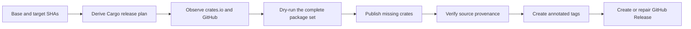

# Resumable Cargo Release

[](https://github.com/ZcashFoundation/resumable-cargo-release/actions/workflows/ci.yml)
[](LICENSE)

Safely publish a Cargo workspace even when an earlier release stopped halfway.

Cargo 1.90 added native multi-package publishing, but a workspace publication
is still non-atomic. One failed upload can leave some versions on crates.io,
and retrying the original package set can then collide with versions that
already exist. Resumable Cargo Release derives the intended release from 2
immutable commits, verifies crates.io and GitHub state, and creates only what is
still missing.

This action is not specific to Zebra. It works with a single Rust package or a
Cargo workspace in any GitHub repository that publishes to crates.io.

## Is this action a fit?

Use Resumable Cargo Release when:

- an approved commit already contains the versions that should be released;
- the source is hosted on GitHub, and packages publish to crates.io;
- the workflow needs to recover safely from partial workspace publication;
- existing crate versions must be verified against the approved source commit;
  and
- tags and an optional GitHub Release should appear only after every crate is
  available.

For a single crate, `cargo publish` may be sufficient. This action adds the most
value when a workspace has several publishable crates, a release must survive
reruns, or a server needs a verification gate between crate publication and its
public tag or GitHub Release.

Current scope:

- GitHub repositories and GitHub Releases;
- the crates.io registry;
- Cargo 1.90 or newer;
- one Cargo workspace per action invocation; and
- annotated Git tags plus, optionally, one product-level GitHub Release.

Other Git forges and Cargo registries are not supported.

## Where it fits

Resumable Cargo Release owns the post-merge publication and recovery boundary.
It composes with existing release tools instead of replacing them.

| Tool                                                                        | Responsibility                                                                                                                                   |
| --------------------------------------------------------------------------- | ------------------------------------------------------------------------------------------------------------------------------------------------ |
| [release-plz](https://github.com/release-plz/release-plz)                   | Update versions and changelogs, then prepare the Release PR. Its `release` command remains a simpler option when phased recovery is unnecessary. |
| Resumable Cargo Release                                                     | Reconstruct the approved release, verify existing crates, publish the missing set with native Cargo, then reconcile tags and release metadata.   |
| [crates-io-auth-action](https://github.com/rust-lang/crates-io-auth-action) | Supply a short-lived crates.io token through trusted publishing.                                                                                 |
| [dist](https://github.com/axodotdev/cargo-dist)                             | Build and distribute binaries or installers after the source release is complete.                                                                |

[publish-crates](https://github.com/katyo/publish-crates) is a useful alternative
that implements its own workspace dependency checks and publication ordering.
Resumable Cargo Release instead delegates multi-package ordering to Cargo 1.90
or newer, then concentrates on commit provenance, rerun safety, and GitHub
finalization.

## How it works



The target commit is the desired source of truth. The action selects
crates.io-publishable workspace packages whose versions differ between the base
and target commits. Before writing anything, it observes every planned crate,
tag, and optional GitHub Release.

Existing crate versions count as complete only when their packaged
`.cargo_vcs_info.json` records the target commit without a dirty source flag.
Tags must resolve to the same target commit. Mutable GitHub Release metadata can
be repaired, but contradictory immutable state stops the run.

## Quick start

### 1. Add release policy

Create `.github/resumable-cargo-release.yml` in the consuming repository:

```yaml
tagTemplate: "{name}-v{version}"
```

That minimal policy publishes every changed crates.io package and creates one
annotated tag per package. Add a product-level GitHub Release when the workspace
contains a primary application or server:

```yaml
tagTemplate: "{name}-v{version}"

packageOverrides:
  example-server:
    tagTemplate: "v{version}"

githubRelease:
  package: example-server
  nameTemplate: "Example Server {version}"
  notesFile: CHANGELOG.md
  notesHeadingTemplate: "## [Example Server {version}]"
  makeLatest: auto
```

The optional GitHub Release is included only when its configured package
version changes. A library-only release therefore publishes crates and creates
crate tags without creating a product release.

### 2. Configure crates.io

Configure [trusted publishing](https://crates.io/docs/trusted-publishing) for
each existing crate, then allow the release job to request an OpenID Connect
token with `id-token: write`. The first version of a new crate may need to be
published with a conventional crates.io token before trusted publishing can be
configured for later versions.

### 3. Add a workflow

This complete workflow runs a release from start to finish. Replace
`<full-commit-sha>` with a released commit from this repository.

```yaml
name: Release Cargo workspace

on:
  workflow_dispatch:
    inputs:
      base_sha:
        description: Commit before the approved version changes
        required: true
        type: string
      target_sha:
        description: Approved release commit
        required: true
        type: string

permissions:
  contents: write
  id-token: write

jobs:
  release:
    runs-on: ubuntu-latest
    environment: release

    steps:
      - name: Checkout approved release commit
        uses: actions/checkout@d23441a48e516b6c34aea4fa41551a30e30af803 # v6
        with:
          ref: ${{ inputs.target_sha }}
          fetch-depth: 0
          persist-credentials: false

      - name: Install Cargo 1.90
        uses: actions-rust-lang/setup-rust-toolchain@166cdcfd11aee3cb47222f9ddb555ce30ddb9659 # v1.17.0
        with:
          toolchain: "1.90.0"

      - name: Authenticate to crates.io
        id: crates_io
        uses: rust-lang/crates-io-auth-action@c6f97d42243bad5fab37ca0427f495c86d5b1a18 # v1.0.5

      - name: Publish and finalize release
        uses: ZcashFoundation/resumable-cargo-release@<full-commit-sha>
        with:
          phase: all
          base-sha: ${{ inputs.base_sha }}
          target-sha: ${{ inputs.target_sha }}
          github-token: ${{ github.token }}
        env:
          CARGO_REGISTRY_TOKEN: ${{ steps.crates_io.outputs.token }}
```

The base SHA must be an ancestor of the target SHA, and both values must be full
40-character commit IDs. The target checkout must be clean and contain full
history. In a release-plz workflow, these commits normally bracket the merged
Release PR, but each repository retains authority over that policy.

Pin every action to a full commit SHA. GitHub treats a full SHA as the only
immutable action reference, and Dependabot can keep pinned actions current.

### Triggering downstream workflows

Tags and releases created with the workflow's `GITHUB_TOKEN` do not normally
start new workflow runs. If finalization should trigger artifact or deployment
workflows, pass a GitHub App installation token or a suitably scoped personal
access token as `github-token`.

For a GitHub App, generate the token with
[actions/create-github-app-token](https://github.com/actions/create-github-app-token)
and grant only `contents: write`.

## Add a product verification gate

Server and application repositories often need to verify the published product
before exposing a public tag or GitHub Release. Split publication and
finalization around that repository-owned check:

```yaml
- name: Publish missing crates
  uses: ZcashFoundation/resumable-cargo-release@<full-commit-sha>
  with:
    phase: publish
    base-sha: ${{ inputs.base_sha }}
    target-sha: ${{ inputs.target_sha }}
    github-token: ${{ steps.release_app.outputs.token }}
  env:
    CARGO_REGISTRY_TOKEN: ${{ steps.crates_io.outputs.token }}

- name: Verify the published product
  run: cargo install --locked example-server --version "${{ inputs.version }}"

- name: Finalize tags and GitHub Release
  uses: ZcashFoundation/resumable-cargo-release@<full-commit-sha>
  with:
    phase: finalize
    base-sha: ${{ inputs.base_sha }}
    target-sha: ${{ inputs.target_sha }}
    github-token: ${{ steps.release_app.outputs.token }}
```

The `publish` phase completes only after every planned crate matches the target
commit. The `finalize` phase then creates missing tags and the optional GitHub
Release. A failed verification leaves a recoverable release with no public
finalization state.

## Recovery behavior

Each run submits a missing package set to Cargo at most once, then polls
crates.io without resubmitting that set. A later workflow rerun observes what
succeeded and derives the remaining package set from external state.

| State         | Meaning                                                                    | Result                                                             |
| ------------- | -------------------------------------------------------------------------- | ------------------------------------------------------------------ |
| `matching`    | The object matches the target commit and release plan.                     | Keep it unchanged.                                                 |
| `missing`     | The object does not exist.                                                 | Create it in `publish`, `finalize`, or `all`.                      |
| `repairable`  | A GitHub Release has the correct tag but mutable metadata differs.         | Update its name, notes, draft state, or explicit latest selection. |
| `conflicting` | Existing immutable state points at another commit or contradicts the plan. | Stop before further writes.                                        |
| `transient`   | crates.io or GitHub could not be observed reliably.                        | Stop with a retryable report.                                      |

Finalization starts only after every planned crate version exists with the
expected Cargo-recorded commit. The action creates tags next and the optional
GitHub Release last, re-observing state after each mutation attempt to handle
concurrent creation safely.

## Configuration reference

Templates support `{name}` and `{version}`:

| Field                                 | Required             | Default             | Purpose                                                     |
| ------------------------------------- | -------------------- | ------------------- | ----------------------------------------------------------- |
| `tagTemplate`                         | No                   | `{name}-v{version}` | Tag format for every selected package.                      |
| `packageOverrides.<name>.tagTemplate` | No                   | Global tag template | Per-package tag format.                                     |
| `githubRelease.package`               | For a GitHub Release |                     | Package whose version identifies the product release.       |
| `githubRelease.nameTemplate`          | No                   | `{name} {version}`  | GitHub Release name.                                        |
| `githubRelease.notesFile`             | For a GitHub Release |                     | Release notes file inside the target checkout.              |
| `githubRelease.notesHeadingTemplate`  | No                   | Entire notes file   | Markdown heading prefix used to select one release section. |
| `githubRelease.prerelease`            | No                   | Derived from semver | Override prerelease status.                                 |
| `githubRelease.makeLatest`            | No                   | `auto`              | `auto`, `true`, or `false`; YAML booleans are accepted.     |

`notesHeadingTemplate` must render a Markdown heading. It matches the heading
prefix, so the source heading may append a link or date. `auto` delegates
latest-release selection to GitHub's legacy version and creation-date policy.
An explicit `true` or `false` is observed and reconciled, while a prerelease
cannot set `makeLatest` to `true`.

## Inputs and outputs

| Input              | Required | Default                               | Description                                                |
| ------------------ | -------- | ------------------------------------- | ---------------------------------------------------------- |
| `phase`            | No       | `all`                                 | `check`, `publish`, `finalize`, or `all`.                  |
| `source-directory` | No       | `.`                                   | Cargo workspace within the target checkout.                |
| `base-sha`         | Yes      |                                       | Full commit SHA before the approved release change.        |
| `target-sha`       | Yes      |                                       | Full approved release commit SHA.                          |
| `config-path`      | No       | `.github/resumable-cargo-release.yml` | Policy path relative to the workflow checkout.             |
| `github-token`     | Yes      |                                       | Token used to observe tags and releases in every phase.    |
| `attempts`         | No       | `3`                                   | Registry observations after one Cargo publication attempt. |

The `plan` output contains the deterministic release plan as JSON. The `report`
output contains observations for the selected phase. A `complete` report from
`publish` means crate publication is complete; tags and the GitHub Release can
remain missing until `finalize` succeeds. A failed publication report includes
`operationError` when Cargo returned an error.

## Phases

| Phase      | Behavior                                                                     |
| ---------- | ---------------------------------------------------------------------------- |
| `check`    | Observe all state; if crates are missing, dry-run the complete Cargo plan.   |
| `publish`  | If needed, dry-run the complete plan, publish missing crates, then poll.     |
| `finalize` | Require every crate, then reconcile tags and the optional GitHub Release.    |
| `all`      | Publish missing crates and continue to finalization after crates.io matches. |

`check` exits successfully when desired state is incomplete because that is the
normal pre-release condition. Its JSON report uses `reason: "incomplete"` to
describe missing objects. Contradictions, transient observation failures, and
Cargo dry-run failures still fail the step.

## Security and permissions

The action accepts package identities only from Cargo metadata at the target
commit. It passes package names as argument-array elements instead of shell
source, bounds downloaded crate archives, parses them without extracting files,
and verifies the archive's Cargo-recorded source commit.

The crates.io token stays in `CARGO_REGISTRY_TOKEN`; the official authentication
action revokes its temporary token when the job ends. The GitHub token is used
only for repository tag and release APIs. Prefer a protected release
environment, `contents: write`, and `id-token: write`, without broader
permissions.

The action clones the local Git object database into a temporary directory to
read base metadata without mutating the caller's checkout. `config-path` is
resolved from the workflow checkout, while `source-directory` and release-note
files identify the immutable release source. A recovery workflow can therefore
run current action code and policy against a separate historical source
checkout.

## Limitations

- Only crates.io and GitHub are supported.
- The action does not choose versions, update changelogs, or create a Release
  PR.
- It does not build binaries, attach artifacts, or deploy a product.
- It requires Cargo 1.90 or newer for native multi-package publication.
- It creates annotated tags for changed crates; lightweight tags are not an
  option.
- A configured GitHub Release belongs to one changed package per invocation.

## License

Licensed under the MIT License.
